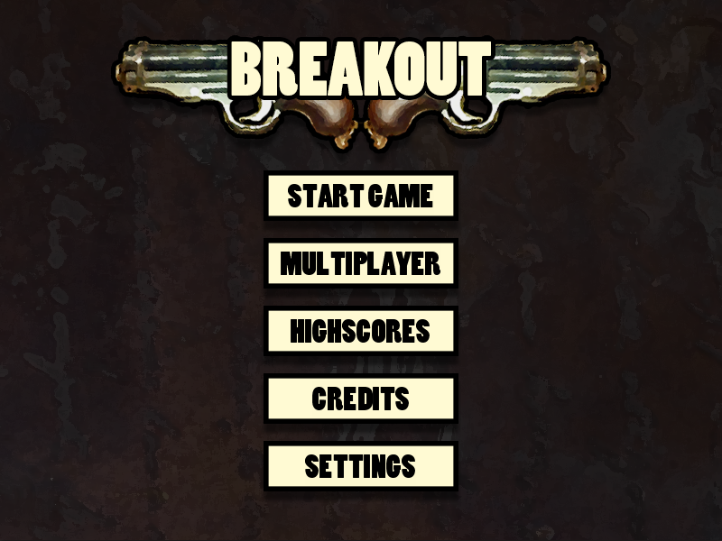

# Breakout

## Description

A project as part of the course FOP (functional object-oriented programming) at the TU Darmstadt.

This is a reimplementation of the game Breakout using LWJGL and a given template.

## Features

* Stick movement
* Ball movement
* Ball collides with other entities (i.e. Border and Stick)
* Pause game on shortcut
* Koop-Multiplayer
* Custom graphics (including game icon)
* Moveable blocks
* Ball speed increases over time
* Particle effects (flames for the stick)
* Pause game
* Multiple maps
* Items (including temporarily ones)
* Sounds
    1. Effects (like item item pickup)
    2. Background music

### Items

* Slower/Faster ball
* Bigger/Smaller stick
* Smash-Ball (ball destroys everything on it's way instantly without bouncing back)
* SloMo (makes temporarily everything slower including music)
* Additional ball (Adds a new ball to the game)
* Health point (Adds a new health point)

### Sounds

* Background music loop
* Audio clips
    1. Item pickup
    2. Ball hits stick
    3. Ball hits block

## Setup

1. Import as maven project
2. Set 'Breakout.java' as main class
3. Add '-Djava.library.path=PATH_TO_LWGL_NATIVE' (example: '-Djava.library.path=native/windows') as vm startup argument

## Screenshots

Take a look at the [screenshots folder](screenshots)

## Available keyboard shortcuts

| State | Input | Effect |
| --- | ---|---|
| Gameplay | Left Arrow | Moves the stick left |
| Gameplay | Right Arrow | Moves the stick right |
| Gameplay | P | Pauses the game |
| Gameplay | Space | Starts the game on a new game |
| Gameplay | A | Moves left for Player 2 (Multiplayer) |
| Gameplay | D | Moves right for Player 2 (Multiplayer) |

## Command arguments

* (Optional) --level=[0-3] Overrides the initial map when you start a new game

## Credits

### Fonts

* [Poplar](https://ufonts.com/fonts/poplar.html)

### Sounds

* [Background music](https://www.looperman.com/loops/detail/93477/drums-and-rust-by-flsouto-free-170bpm-industrial-drum-loop)
royalty-free

## Licenses

### Slick2D

> Copyright (c) 2013, Slick2D
> 
> All rights reserved.
> 
> Redistribution and use in source and binary forms, with or without modification, are permitted provided that the following conditions are met:
> 
> * Redistributions of source code must retain the above copyright notice, this list of conditions and the following disclaimer.
> * Redistributions in binary form must reproduce the above copyright notice, this list of conditions and the following disclaimer in the documentation and/or other materials provided with the distribution.
> * Neither the name of the Slick2D nor the names of its contributors may be used to endorse or promote products derived from this software without specific prior written permission.
> 
> THIS SOFTWARE IS PROVIDED BY THE COPYRIGHT HOLDERS AND CONTRIBUTORS “AS IS” AND ANY EXPRESS OR IMPLIED WARRANTIES, INCLUDING, BUT NOT LIMITED TO, THE IMPLIED WARRANTIES OF MERCHANTABILITY AND FITNESS FOR A PARTICULAR PURPOSE ARE DISCLAIMED. IN NO EVENT SHALL THE COPYRIGHT OWNER OR CONTRIBUTORS BE LIABLE FOR ANY DIRECT, INDIRECT, INCIDENTAL, SPECIAL, EXEMPLARY, OR CONSEQUENTIAL DAMAGES (INCLUDING, BUT NOT LIMITED TO, PROCUREMENT OF SUBSTITUTE GOODS OR SERVICES; LOSS OF USE, DATA, OR PROFITS; OR BUSINESS INTERRUPTION) HOWEVER CAUSED AND ON ANY THEORY OF LIABILITY, WHETHER IN CONTRACT, STRICT LIABILITY, OR TORT (INCLUDING NEGLIGENCE OR OTHERWISE) ARISING IN ANY WAY OUT OF THE USE OF THIS SOFTWARE, EVEN IF ADVISED OF THE POSSIBILITY OF SUCH DAMAGE.

### LWJGL

> Copyright © 2012-present Lightweight Java Game Library
> All rights reserved.
> 
> Redistribution and use in source and binary forms, with or without modification, are permitted provided that the following conditions are met:
> 
> Redistributions of source code must retain the above copyright notice, this list of conditions and the following disclaimer.
> Redistributions in binary form must reproduce the above copyright notice, this list of conditions and the following disclaimer in the documentation and/or other materials provided with the distribution.
> Neither the name Lightweight Java Game Library nor the names of its contributors may be used to endorse or promote products derived from this software without specific prior written permission.
> 
> THIS SOFTWARE IS PROVIDED BY THE COPYRIGHT HOLDERS AND CONTRIBUTORS "AS IS" AND ANY EXPRESS OR IMPLIED WARRANTIES, INCLUDING, BUT NOT LIMITED TO, THE IMPLIED WARRANTIES OF MERCHANTABILITY AND FITNESS FOR A PARTICULAR PURPOSE ARE DISCLAIMED. IN NO EVENT SHALL THE COPYRIGHT HOLDER OR CONTRIBUTORS BE LIABLE FOR ANY DIRECT, INDIRECT, INCIDENTAL, SPECIAL, EXEMPLARY, OR CONSEQUENTIAL DAMAGES (INCLUDING, BUT NOT LIMITED TO, PROCUREMENT OF SUBSTITUTE GOODS OR SERVICES; LOSS OF USE, DATA, OR PROFITS; OR BUSINESS INTERRUPTION) HOWEVER CAUSED AND ON ANY THEORY OF LIABILITY, WHETHER IN CONTRACT, STRICT LIABILITY, OR TORT (INCLUDING NEGLIGENCE OR OTHERWISE) ARISING IN ANY WAY OUT OF THE USE OF THIS SOFTWARE, EVEN IF ADVISED OF THE POSSIBILITY OF SUCH DAMAGE.
